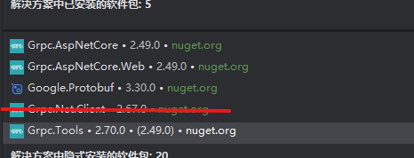
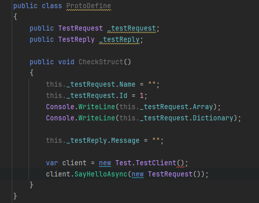
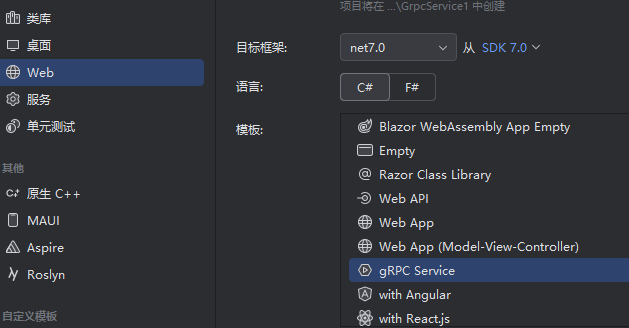
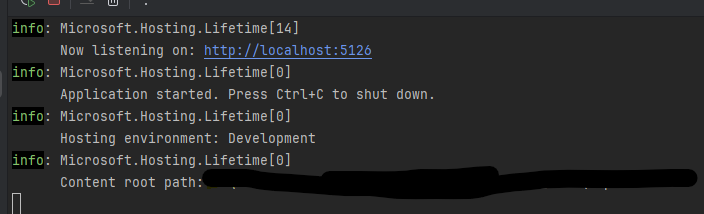
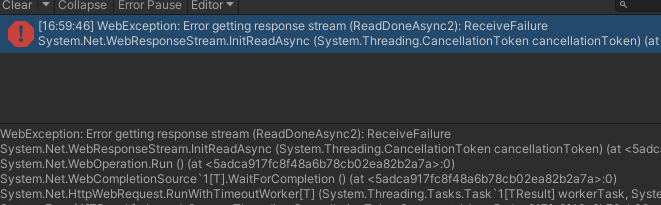
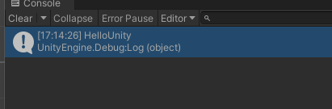

# 在Unity中使用grpc

## 2025/3/12更新

经过测试，下述方案在win平台和android平台可以正常运行，webgl平台则完全不行。因为webgl平台的程序为单线程运行，grpc.net库的实现强依赖于.net的httpClient进行网络通信，因此异步grpc会完全阻塞线程，同步grpc也会出现报错。因此如果有需要在webgl项目中使用grpc功能，不如直接在js部分接入[grpc的web端实现](https://github.com/grpc/grpc-web)，将调用结果再转发给unity部分。（吐槽：虽然grpc.net.clinet.web这个插件名字里带有web，却不支持在webgl平台运行呢。）

## 前言

### 关于为什么要在unity项目中加入grpc

实际上作者并未在项目中遇到需要rpc功能的需求（可能是本人比较菜），只是看到一个[基于grpc的unity框架](https://github.com/Cysharp/MagicOnion),想要尝试使用原生的grpc功能实现unity的rpc调用。本文章中所实现的功能并未在本人的任何项目中用到，grpc的服务器也只在本地运行过，因此关于在实际生产过程中使用到本文章内的实践所产生的任何问题，本人可能无法回答，推荐有实际生产需求的人使用上面的插件进行rpc的实现。本文章也只是将此次实践的流程记录下来。实践过程中使用的IDE为Jetbrains Rider，关于nuget包的管理界面可能与Visual Studio有所差异。

## 涉及到的概念

- **RPC Framework**：通过网络实现客户端代买调用服务器的功能逻辑，可以实现异步甚至同步的调用。因此客户端和服务器不必使用同一种代码，只要保证调用时遵守同一种协议即可
- **Protobuf**：google开发的一种数据序列化的格式（以及配套的相关工具）。据官方文档所说数据量要小于json一些，可读性要差一些，因此可以作为上述调用时传输数据的格式
- **grpc**:google开发的一种rpc框架，包含各种语言上的实现。截至本文章事件，C#语言的仓库已经停止更新仅维护(相关的nuget包为grpc.core)，使用grpc-dotnet作为替代。本文章中客户端引入的是最新版本的grpc-dotnet(nuget version 2.67.0)

## 创建通信使用的数据格式

grpc使用protobuf作为通信时的数据传输格式。如同上面所述，protobuf基于减少数据体积的原因采用了更加精简的序列化方式(按照官方文档所说，protobuf序列化的数据将仅包含json格式数据中的key部分，并且对于不同类型数据的序列化方式也有优化)，因此在grpc框架下，必须事先约定好要传输什么格式的数据，.proto文件就是定义这个数据格式的文件。
protobuf提供了一套工具，可以使用CodeDom技术直接在编译时使用写好的.proto文件生成为grpc调用所需的类和方法，或者也可以手动调用protobuf的工具进行.cs代码的生成。不论使用何种方法，最终要将生成出来的类和方法引用到服务器和客户端的工程中。
本人采取的方式是单独开一个类库，仅用于构建项目所需的.proto文件，再在服务器和客户端工程中分别引用这个类库。这种方式可以避免出现多个.proto文件副本，也不需要在客户端和服务器中再引入构建所需的相关插件包。

具体流程：先新建一个C#类库项目，添加Google.Protobuf和Grpc.Tools两个包（后续在创建服务器项目时也会自动引入这两个包，所以如果准备把类库项目和服务器项目放在同一个解决方案下的话也可以先按照后面的流程创建服务器项目，然后在类库项目中引用自动添加的）。


_项目中使用的nuget包，划掉的是测试用的，实际这边用不到_

在项目中新建文件夹用于存放本项目的所有.proto文件,按照正确的格式进行编辑（更详细的格式说明可以看参考文献中贴出的ProtoBuf文档）。

```proto
syntax ="proto3";
package RPCTest;

option csharp_namespace="ProtoExtend.RPCTest";

//手动使用默认的ProtoTool进行csharp代码输出会忽略service的生成，需要附加grpc_csharp_plugin插件(grpc.tools包里有)
//建议用文中的方法自动生成
service Test {
  rpc SayHello(TestRequest) returns (TestReply);
}

message TestRequest {
  //use this type to add comments
  /*or this type*/
  reserved 4,99,108,118 to 120;//used but deleted field numbers
  int32 id=1;
  string name = 2;
  repeated string array=3;//no key collection define
  map<string,string> dictionary=5;//key-value collection define
}

message TestReply {
  string message = 1;
}
```

打开项目的.csproj文件，将所有用到的.proto文件按照正确的格式填入。

```xml
    <ItemGroup>
        <Protobuf Include="..\Proto\Test.proto"/>
    </ItemGroup>
```

之后可以在项目中新建一个.cs文件，测试是否自动生成了对应的类和方法。


## 创建grpc服务器

新建一个项目或者解决方案，在模板中选择grpc Server，此模板创建完成后将自动引入Google.Protobuf,Grpc.Aspnet.Core和Grpc.Tools三个nuget包。

创建完成后，服务器项目将会自带一个Greeter.proto，并且在服务器的启动脚本Program.cs中已经给出了启用此项服务的范例代码。如果是按照本文的方法使用单独的类库约定数据格式，可以移除服务器项目中的Proto文件夹和Grpc.Tools包，重载本项目。在服务器项目中引入之前创建的类库，将Program.cs中调用模板服务的代码替换为自己定义的服务，然后就可以尝试运行服务器项目了，没有意外的话，会出现下面的信息，表示服务器启动成功。


# 在Unity中引入需要的插件包

推荐使用[NugetForUnity](https://github.com/GlitchEnzo/NuGetForUnity)对Unity项目中的nuget包进行管理。在Unity中引入Google.Protobuf和Grpc.Net.Client两个包，并将先前创建的类库引入Unity。在Unity中使用以下代码进行方法的调用：

```c#
        var channel = GrpcChannel.ForAddress("https://localhost:7254");
        var client = new Test.TestClient(channel);
        var response = client.SayHello(
            new TestRequest() { Name = "Unity" });

        Debug.Log(response.Message);
```

# 修改客户端和服务器以适配http/1.1

完成了上面的步骤，你就会惊喜地发现，unity和服务器双端都会出现报错，无法正常执行功能。


<figure>服务器报错</figure>



<figure>unity报凑</figure>
但是因为服务器端同样有报错，证明网络通信其实是没问题的。虽然我没有查到具体的文档说明，但是unity应该是不支持http/2协议的，但是grpc基于通信质量的需求，默认只允许http/2的方式进行通信，因此我们必须想办法将协议更改为http/1.1版本。grpc为了兼容web端的使用，官方提供了将通信协议更改为http/1.1的中间件(但是是能使用的grpc功能会受到限制)，我们需要使用到这个中间件。
在服务器项目中增加Grpc.Aspnet.Core.Web包，并修改服务器启动的代码对应部分为

```c#
builder.Services.AddGrpc();
var app = builder.Build();
app.UseGrpcWeb(new GrpcWebOptions { DefaultEnabled = true });
// Configure the HTTP request pipeline.
app.MapGrpcService<TestService>();
```

修改Server的配置文件appsettings.json中对应部分为：

```json
"Kestrel": {
    "EndpointDefaults": {
      "Protocols": "Http2 And Http1"
    }
  }
```

在Unity中增加Grpc.Client.Web包，并修改调用代码为

```c#
        var channel = GrpcChannel.ForAddress("https://localhost:7254", new GrpcChannelOptions
        {
            HttpHandler = new GrpcWebHandler(new HttpClientHandler())
        });
        var client = new Test.TestClient(channel);
        var response = await client.SayHelloAsync(
            new TestRequest() { Name = "Unity" });
        Debug.Log(response.Message);
```

至此，通过unity调用一个最简单的grpc服务就能实现了


## 附：使用Postman进行服务器正常运行的检测

排查与网络相关的错误往往是件很麻烦的事情，使用Postman对于grpc服务器的功能进行检测可以大大减小排查的范围。Postman支持对grpc服务器的服务进行调用，但是使用时要注意一些地方：

- Postman已经包含对grpc服务的调用模板，新建一个Request，选择模板为gRPC
- url的前缀需要将http或者https替换为grpc，使用地址栏前面的TLS按键控制请求的是否为https地址
- 地址栏的后方有一个选项，导入你需要检测的grpc服务的.proto文件，Postman可以通过解析帮你列出.proto文件中定义的服务和请求返回的格式

## 附：参考文献

- [gRPC项目地址](https://github.com/grpc/grpc)
- [Unity + Grpc + protobuf + C# 使用流程详解](https://blog.csdn.net/qq_43505432/article/details/109243044)
- [使用 ASP.NET Core 的 gRPC 服务](https://learn.microsoft.com/zh-cn/aspnet/core/grpc/aspnetcore?view=aspnetcore-9.0&tabs=visual-studio)
- [ASP.NET Core gRPC 应用中的 gRPC-Web](https://learn.microsoft.com/zh-cn/aspnet/core/grpc/grpcweb?view=aspnetcore-9.0)
- [Proto文件编写规范](https://protobuf.dev/programming-guides/proto3/)

> 碎碎念：确实有些被DeepSeek打击到了，中间调试过程中几次报错，翻遍了对应项目的issus和说明文档都没能找到确切的解决方法，最后没办法查DeekSeek却能给到可行的思路(っ╥╯﹏╰╥c)，看来还是要学会使用工具才有出路
